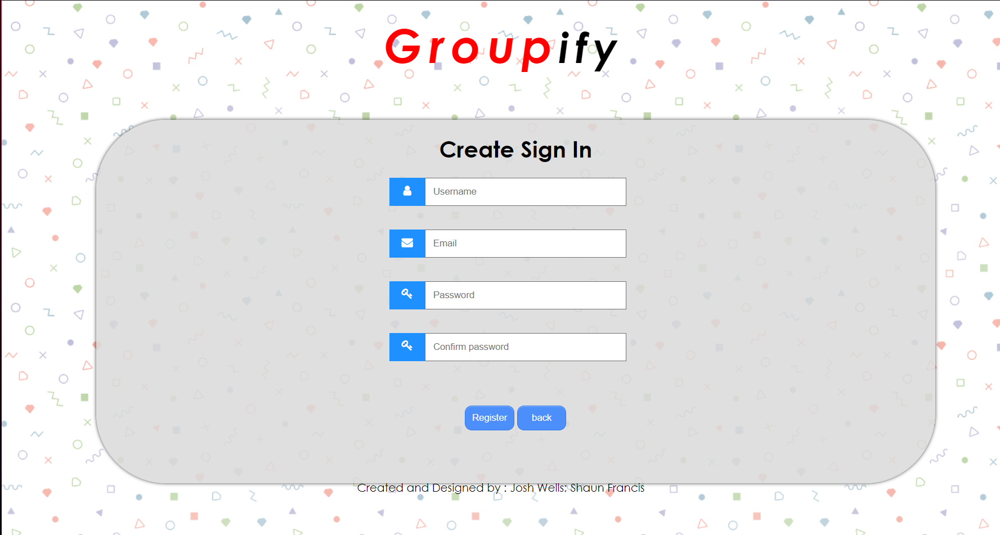

# MilkbagVersion2.github.io
Front end for our collaborative web tool

#Whats the goal?
- The goal of this project is to further my understanding and skills in full stack web development.

- This will also be a test and example of my teamwork and project managment skills, as it is meant to be made within a certain timespan.  

# Sign in using in the page above if account is already created.
- If you have not already created an account, click the link below the sign in button and input needed information in the page below.
- The email used must not have an account linked to it already. 

# NOTE: Second account to Milkbag19. 
